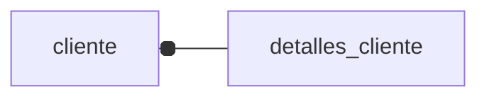
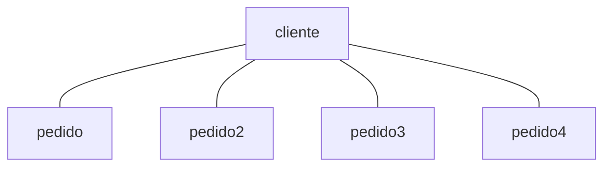

## SQL para crear la tabla
Con el ENGINE elegimos esa no se por que
Tabla para los _**detalles de los clientes**_
```SQL
CREATE TABLE `detalles_cliente` (
 `id` int(11) NOT NULL AUTO_INCREMENT,
 `web` varchar(128) DEFAULT NULL,
 `tlfno` varchar(128) DEFAULT NULL, 
 `comentarios` varchar(128) DEFAULT NULL,
  PRIMARY KEY(`id`)
 ) ENGINE= INNODB;
```
Otra tabla para _**clientes**_
```SQL
CREATE TABLE cliente(
    `id` int(11) NOT NULL AUTO_INCREMENT,
    `nombre` varchar(45) DEFAULT NULL,
    `apellido` varchar(45) DEFAULT NULL,
    `direccion` varchar(45) DEFAULT NULL,
    PRIMARY KEY (`id`),
    KEY `FK_DETALLE` (`id`),
    CONSTRAINT `FK_DETALLE` FOREIGN KEY (`id`) REFERENCES `detalles_cliente` (`id`) ON DELETE NO ACTION ON UPDATE NO ACTION
) ENGINE=InnoDB AUTO_INCREMENT=1 DEFAULT CHARSET=latin1;
```
Tabla **_pedido_**, hace referencia a la tabla cliente por el campo cliente_id (FK)
```SQL
CREATE TABLE pedido (id INT(3) NOT NULL AUTO_INCREMENT,
    fecha DATE DEFAULT NULL,
    forma_pago VARCHAR(15), 
    cliente_id INT(3) DEFAULT NULL, 
    PRIMARY KEY(id), 
    KEY FK_CLIENTE_ID(cliente_id),
    CONSTRAINT cliente_id FOREIGN KEY(cliente_id) REFERENCES cliente(id) 
        ON DELETE NO ACTION ON UPDATE NO ACTION
) ENGINE=INNODB AUTO_INCREMENT=1 DEFAULT CHARSET=latin1;
```
## Relacion entre modelos

Crear la relacion entre las dos tablas


Añadiendo a la **tabla cliente** la regla "FK_DETALLES" (durante la creacion) en donde id es clave foranea que hace 
refencia al id de la tabla **detalles_cliente**, sin accion en el borrado ni en la modificacion (update) 
```SQL  
CONSTRAINT `FK_DETALLE` FOREIGN KEY (`id`) REFERENCES `detalles_cliente` (`id`) ON DELETE NO ACTION ON UPDATE NO ACTION
```
Tambien es necesario en el modelo (cliente) que hace referencia (detalles_cliente)
indicarlo con codigo java
```java
@OneToOne(cascade = CascadeType.ALL)
@JoinColumn
private detalles_cliente detalleCliente;
```
Hay que tener cuidado porque de la forma definida hasta ahora es una relacion unidireccional de sentido 
Cliente --> Detalles_Clientes, si quisiesemos recuperar el cliente a través de detalle cliente no podríamos
<br>
Para conseguir **bidireccionalidad** es necesario. ¡Cuidado con llamar recursivamente al toString derivara en error al querer
mostrar el objeto con todos sus campos!
<br>
Debe añadirse en este caso el codigo java a DetalleCliente para hacerlo bidireccional
```java
    /**
     * Para conseguir la bidireccionalidad debe figurar en los dos el OneToOne
     * -mappedBy debe ser el nombre que tiene el atributo (Clientes) desde el que se hace referencia
     * a esta clase. Cliente hace referencia a DetalleCliente por el atributo detalleCliente que es el que
     * podnremos en mappedBy
     */
    @OneToOne(mappedBy = "detalleCliente",cascade = CascadeType.ALL) //El nombre de OneToOne por el que se relacionan en clientes
    @JoinColumn(name="id")
    private Cliente cliente;
```
### Eliminacion en Casacada
Ambos atributos estan realcionados entre si mediante borrado y ¿modificacion en cascada? 
por lo que el borrado de un cliente hará que se borre su detalle asociado.<br>
Si se quisiese en este caso eliminar un detalleCliente seria necesario:<br> 1. Eliminar
su asociacion en [DetalleCliente.java](src%2Fmain%2Fjava%2Forg%2Fexample%2FModel%2FDetalleCliente.java)
a cliente
<br>2. Ejecutar codigo en donde el DetalleCliente de un cliente se ponga null para eliminar la asociacion
de clave foránea<br>3. Eliminar la regla en la BD de clave foranea (FK_DETALLE, en la tabla cliente)
```java
//(1)
public class DetalleCliente {
    @OneToOne(mappedBy = "detalleCliente", cascade = CascadeType.ALL) --> @OneToOne(mappedBy = "detalleCliente") 
    @JoinColumn(name = "id")
    private Cliente cliente;
}
//(2)
public static void main(String[] args) {
    DetalleCliente detalleCliente = session.get(DetalleCliente.class,1);
    detalleCliente.getCliente().setDetalleCliente(null);
}
```
## Fetch Type
[youtube enlace al video que lo explica](https://www.youtube.com/watch?v=Bi3uIoW2nG4&list=PLU8oAlHdN5Blq85GIxtKjIXdfHPksV_Hm&index=64)

**_Eager_** (**ansioso**): es un tipo de consulta que _devuelve toda la informacion de golpe_. Suele ser por defecto.<br>
Por ejemplo: devuelve todos la informacion que tiene sobre un cliente (datos del cliente + datos pedidos), aunque no nos interese la informacion de sus pedidos
solo la del cliente.
<br>
Conviene usarlo cuando queremos una informacion en concreto ampliada, por ejemplo un cliente y su pedido extraera solamente los pedidos del cliente 
y la informacion del cliente.<br>
Si se quiere la informacion del cliente mas sus pedidos esta es la mejor opcion.<br>
**Mas costoso(+) pero menos llamadas(-).**

**_Lazy_** (**perezoso**): nos devuelve la informacion _especifica_.CArga la informacion poco a poco<br>
Nos devuelve la informacion especifica. Devuelve la informacion del cliente pero no sus pedidos, estos seran devueltos cuando vayamos
preguntando en especifico por cada uno de ellos.<br>
Si se crea una interfaz grafica y queremos solo la informacion del cliente esta es la adecuada.<br>
**Menos costoso(-) pero mas llamadas(+).**


#### Fetch por defecto
Como suelen venir son los mas adecuados
```table
Relacion        | Fetch por defecto.
̣̣̣̣̣̣̣-------------------------------------
Uno a uno       | Eager
Uno a varios    | Lazy
Varios a uno    | Eager
Varios a varios | Lazy
```
#### Codigo java Fetch
Para indicarlo en el codigo debe figurar en la etiqueta de **@OneToMany** (por ejemplo, en la clase [Cliente.java](src%2Fmain%2Fjava%2Forg%2Fexample%2FModel%2FCliente.java)).
```java
@OneToMany(fetch = FetchType.LAZY,
            mappedBy = "cliente", cascade = {CascadeType.PERSIST, CascadeType.DETACH, CascadeType.MERGE, CascadeType.REFRESH})
    private List<Pedido> pedidos;
```
#### Errores que pueden surgir
VIdeo de sobre Lazy y el cierre de sesion [pildoraInformatica](https://youtu.be/RzA-vgHuoW0?list=PLU8oAlHdN5Blq85GIxtKjIXdfHPksV_Hm)

## Codigo Java Main
Para que la conexion sepa que clases asociar en las transacciones con las bases de datos es
necesario indicarselo antes de obtener la instancia de _Hibernate_. Como en este caso va utilizarse
Cliente e InfoCliente es necesario indicarlo.
<br> El **fichero** es necesario que figure en la ruta _/src/main/resources_ y que tenga una estructura concreta
```java
SessionFactory factory = new Configuration().configure(fichero)
                .addAnnotatedClass(Cliente.class)
                .addAnnotatedClass(InfoCliente.class)
                .buildSessionFactory();
```


### Estructura basica para operar con Hibernate
Despues de obtener una instancia de Hibernate es necesario
<ol>
<li>Obtener una sesion de la instancia de Hibernate</li>
<li>Indicar que se va a realizar iniciar una transaccion</li>
<li>Realizar las operaciones deseadas</li>
<li>Cerrar la sesion y la instancia de Hibernate (factory) </li>
</ol>

```java
Session session = factory.openSession();

        try {
            //Creando un cliente y sus detalles
            Cliente cliente = new Cliente("Nacho","Quintana","Loranca");
            InfoCliente detalleCliente = new InfoCliente("Google","650650650","Buena web");
            cliente.setInfoCliente(detalleCliente);
            //Antes de inciar la transaccion es necesario asociar los objetos
            System.out.println(cliente);
            //Guardamos el cliente, ya mapeado anteriormente
            session.beginTransaction();
            session.persist(cliente);//Save is deprecated use persiste instead
            List<Cliente> listaClientes = session.createQuery("from Cliente",Cliente.class).getResultList();
            //Eliminando el cliente insertado (el unico que hay en la lista)
            session.remove(listaClientes.getFirst());
            //Gracias que esta definido el borrado en cascada se eliminan ambos objetos asociados
            session.getTransaction().commit();

            session.close();
            factory.close();
        } finally {
            factory.close();
        }
```
Codigo basico para **_copia pega_**
```java
String fichero = "hibernate.cfg.xml";
        SessionFactory factory = new Configuration().configure(fichero)
                .addAnnotatedClass(Cliente.class)
                .addAnnotatedClass(DetalleCliente.class)
                .buildSessionFactory();
        Session session = factory.openSession();

        try {
            session.beginTransaction();
            //Sentencia SQL
            session.getTransaction().commit();
            
        } finally {
            session.close();
            factory.close();
        }
    }
```

# ERRORES
Si da un error de la clave foranea y esta todo el codigo bien mejor revisar la creacion de la referencia o de la tabla

# Leak de memoria
Se produce al tener una excepcion y no cerrar la conexion<br>
Mirar control [ControlExcepcionesEliminarCascada.java](src%2Fmain%2Fjava%2Forg%2Fexample%2FControlExcepcionesEliminarCascada.java)
<br>
Por lo que es importante cerrar la conexion y la instancia de Hibernate incluso cuando ocurren errores